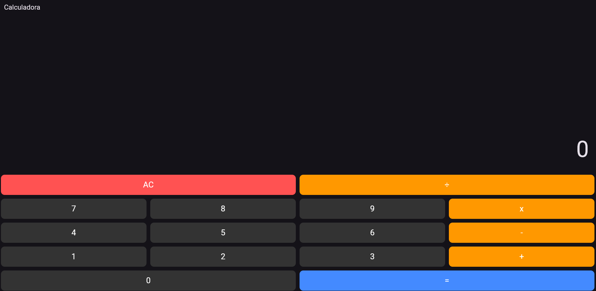

# Trabalho 3 - Aplicação de Calculadora em Flutter

**Disciplina:** Desenvolvimento Mobile  
**Curso:** Engenharia de Software ESOFT7S / Análise e Desenvolvimento de Sistemas ADSIS5S  
**Universidade:** Unicesumar  
**Valor:** 2,5 pontos

---

## 📋 Descrição do Sistema

Este trabalho consiste no desenvolvimento de uma calculadora funcional utilizando o framework **Flutter**. O foco principal da atividade foi a aplicação de **componentização**, separando a interface em widgets reutilizáveis e organizando a lógica de estado do aplicativo.

✅ Funcionalidades implementadas:
- Inserção de números através de teclado numérico.
- Operações matemáticas básicas (Soma, Subtração, Multiplicação e Divisão).
- Exibição do resultado em tempo real no display.
- Função de limpeza total (Botão AC).
- Interface moderna com tema Dark e design minimalista.

---

## 🏗️ Estrutura de Componentização

Seguindo as boas práticas do Flutter e os requisitos do professor, a interface foi dividida para garantir a reutilização de código.

### 1. Widget `BotaoCalculadora` (Componente)
Este widget foi criado em um arquivo separado (`lib/botao.dart`) para padronizar todos os botões do sistema.

| Parâmetro | Tipo | Descrição |
| :--- | :--- | :--- |
| `texto` | String | O rótulo que aparece no botão (ex: "7", "+", "="). |
| `cor` | Color | Define a cor de fundo do botão (Cinza, Laranja, Vermelho). |
| `aoPressionar` | Function | A função que será executada ao clicar no botão. |

### 2. Widget `CalculadoraScreen` (Tela Principal)
Localizado no `lib/main.dart`, gerencia o estado e a árvore de widgets.

| Widget Utilizado | Responsabilidade |
| :--- | :--- |
| `Column` | Organiza a verticalidade entre o Display e o Teclado. |
| `Row` | Organiza as linhas de botões horizontalmente. |
| `Expanded` | Garante que os botões ocupem o espaço proporcional da tela. |
| `setState` | Gerencia a atualização dos números no display ao clicar. |

---

## 🚀 Instruções para Execução

1. **Pré-requisito:** Ter o Dart SDK instalado na máquina
   > Download: https://dart.dev/get-dart

2. **Clone o repositório:**
   ```bash
   git clone https://github.com/VagnerGiraldinoJr/trabalhomobile_1-.git
   cd trabalhomobile_1-
   ```

3. **Instale as dependências:**

    ```Bash
    flutter pub get
4. **Execute o programa:**

    ```Bash
    flutter run -d chrome

📖 Interface do Sistema


## ✅ Requisitos Técnicos Atendidos

    | Utilização do Framework Flutter,✅ Implementado|
    | Componentização de Widgets (Botão reutilizável),✅ Implementado|
    | "Operações Matemáticas (Adição, Subtração, Multiplicação, Divisão)",✅ Implementado|
    | Exibição de Resultado e Limpeza,✅ Implementado|
    | "Layout com Row, Column e Expanded",✅ Implementado|